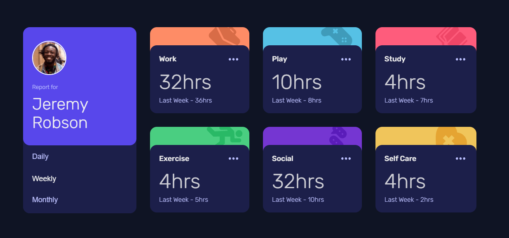

# Frontend Mentor - Time tracking dashboard solution

[Live Site](https://timetrackdashboardisaac.netlify.app/)

## Table of contents

- [Frontend Mentor - Time tracking dashboard solution](#frontend-mentor---time-tracking-dashboard-solution)
  - [Table of contents](#table-of-contents)
  - [Overview](#overview)
    - [The challenge](#the-challenge)
      - [Expected behavior](#expected-behavior)
    - [Screenshot](#screenshot)
    - [Links](#links)
  - [My process](#my-process)
    - [Built with](#built-with)

## Overview

### The challenge

Users should be able to:

- View the optimal layout for the site depending on their device's screen size
- See hover states for all interactive elements on the page
- Switch between viewing Daily, Weekly, and Monthly stats

#### Expected behavior

The text for the previous period's time should change based on the active timeframe. For Daily, it should read "Yesterday" e.g "Yesterday - 2hrs". For Weekly, it should read "Last Week" e.g. "Last Week - 32hrs". For monthly, it should read "Last Month" e.g. "Last Month - 19hrs".

### Screenshot

[Mobile](design/mobile-design.png)

[Desktop](design/desktop-design.png)

### Links

- [Live Site](https://timetrackdashboardisaac.netlify.app/)

## My process

### Built with

- Mobile-first workflow
- Semantic HTML5 markup
- SASS
- CSS custom properties
- Flexbox
- CSS Grid
- JavaScript
- Fetch API
- Animations

